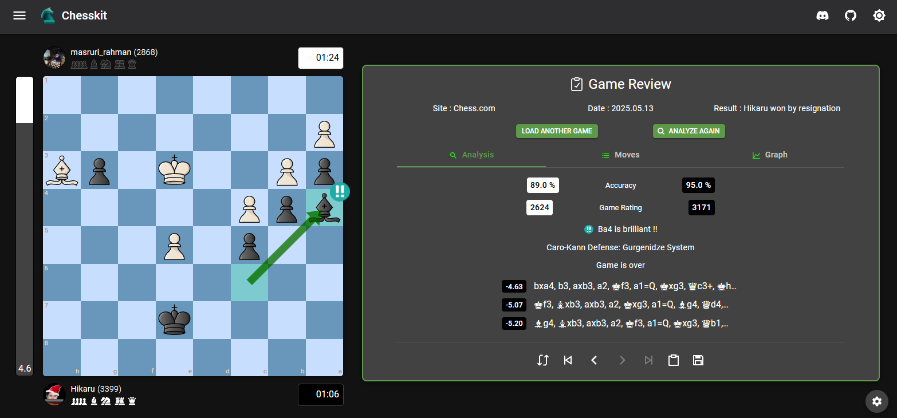

# Chesskit

**Chesskit** is a free, open-source chess website to play, review, analyze, and learn chess games on any device, powered by Stockfish.

[](https://chesskit.org)

---

## Features

- **Play vs Stockfish:** Challenge the world’s strongest chess engine at any Elo.
- **PGN Support:** Import or upload PGN files to load games, with instant analysis and move-by-move review.
- **Game Analysis:** Automatic move classification (Brilliant, Mistake, Blunder, etc.) and evaluation graph.
- **Opening Explorer:** Study chess openings and improve your repertoire.
- **Chess960 & Puzzles:** Play and analyze Chess960 and puzzles.
- **Database:** Store and manage your games in your browser.
- **Responsive Design:** Works on desktop, tablet, and mobile.

---

## Getting Started

### Prerequisites

- **Node.js** v22.11 or higher
- **npm** (comes with Node.js)

### Installation

```bash
git clone https://github.com/GuillaumeSD/Chesskit.git
cd Chesskit
npm install
```

### Running Locally

```bash
npm run dev
```
Open [http://localhost:3000](http://localhost:3000) in your browser.

---

## PGN Support

Chesskit supports PGN (Portable Game Notation)!  
Easily import or upload PGN files to load chess games, instantly analyze them with Stockfish, and review every move. Bring your games from anywhere and get powerful, automatic analysis in one click.

---

## Contributing

Contributions are welcome! Please see [CONTRIBUTING.md](../CONTRIBUTING.md) for guidelines.

---

## License

Chesskit is licensed under the [GNU AGPL-3.0](../LICENCE).

---

## Credits

- Built with [Next.js](https://nextjs.org/), [React](https://reactjs.org/), [Material UI](https://mui.com/), and [Stockfish](https://stockfishchess.org/).
- Inspired by the chess community and open-source spirit.

---

## Links

- [Live Site](https://chesskit.org)
- [Discord Community](#)
- [Feature Backlog](#) 